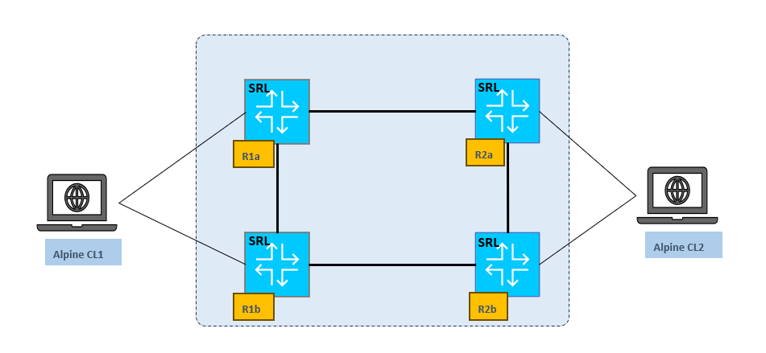

# sample evpn lab

- A baseline setup for EVPN L2 and L3 services made with Nokia [SRL](https://www.nokia.com/networks/ip-networks/service-router-linux-NOS/), using VXLAN transport.
- Runs on [containerlab ](https://containerlab.dev/), see the clab.yml file and edit as your scenario requires (e.g. Leaf&Spine or MH)
- Router configurations are provided under the flat-config dir.


## lab setup
Two Alpine nodes are connected to a four-nodes "core", internal cross-links can be added to mimic a leaf&spine setup.



the picture shows ethernet port connectivity and the underlay IGP setup


these are the services already configured in the configuration, a L2 point to point and a L3 EVPN based service


wireshark pcap evpn_l2.pcap shows EVPN route-type 2 exchange


wireshark pcap evpn_l3.pcap shows EVPN route-type 5 exchange


## client configuration

Just copy'n'paste to Alpine nodes to get reachability for L2/L3 services

```
#CL1
ip address add 192.168.254.1/24 dev eth1
ip address add 10.16.100.1/24 dev eth2
ip route add 10.16.0.0/16 via 10.16.100.254                         
```

```
#CL2
ip address add 192.168.254.2/24 dev eth2
ip address add 10.16.200.1/24 dev eth1
ip route add 10.16.0.0/16 via 10.16.200.254   
```
